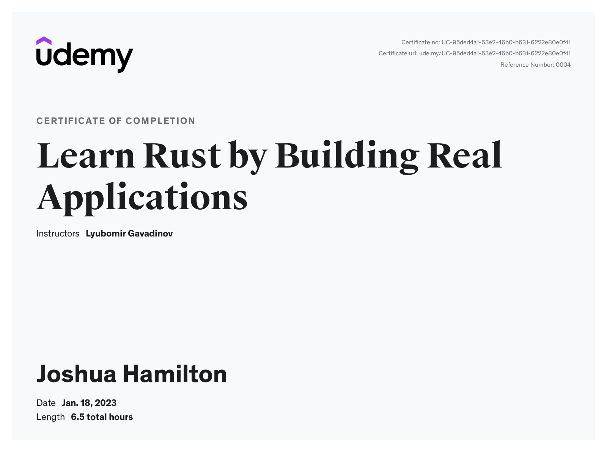

# Learn Rust by Building Real Applications

[Udemy Course](https://www.udemy.com/course/rust-fundamentals/)

> This was a pretty nice way of learning [Rust](https://www.rust-lang.org) while building something real. The bulk of the project is the [server](./server/) and covers a lot of the language. The server is not meant to be production ready; but is still interesting to build.

